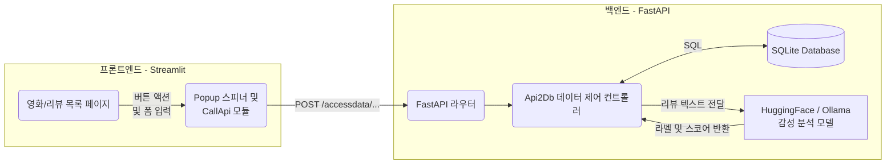
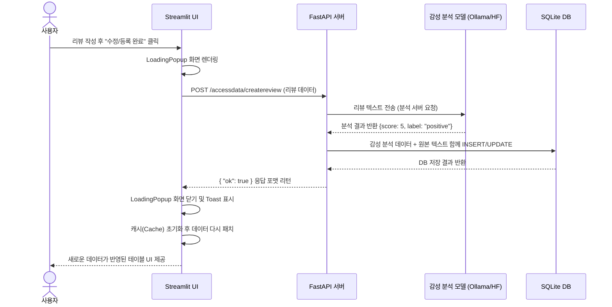

# Mission18 프로젝트 보고서

## 1. 프로젝트 개요

프로젝트명: **Mission18 영화 정보 및 리뷰 감성 분석 서비스**

본 프로젝트는 사용자가 영화 정보 및 리뷰를 리스트로 열람하고, 새로운 영화와 리뷰를 관리할 수 있는 서비스입니다. 
가장 큰 특징은 사용자가 남긴 리뷰 내용을 바탕으로 **AI 모델이 자동으로 내용의 긍정/부정 감성을 분석하고 1~5점 사이의 평점을 부여**하여 시각화한다는 점입니다. 프론트엔드는 Streamlit으로, 데이터 및 모델 서빙을 담당하는 백엔드는 FastAPI 구조로 완전히 분리(Decoupling)하여 개발되었습니다.

### 이 프로젝트의 주요 목적
- AI 기반 감성 분석(Sentiment Analysis)을 실제 사용자 서비스와 연동
- Streamlit과 FastAPI 간의 완전 분리형 Full-Stack 애플리케이션 구조 체험
- 대량의 영화/리뷰 데이터를 조회/필터링/생성/수정/삭제하는 데이터베이스 워크플로우 경험

---

## 2. 데이터 수집 및 구축 (Data Collection)

본 프로젝트의 데이터베이스는 KMDB(한국영화데이터베이스) 오픈 API를 통해 구축되었습니다.

- **수집 도구**: `backend/db/m18_collect.py`
- **수집 범위**: **1900년부터 2026년까지** 제작/개봉된 **대한민국 한국 극영화** 데이터 전체
- **수집 공정**:
  1. KMDB API에 연도별, 국가(대한민국) 필터로 요청
  2. 500개 단위 페이지네이션 처리를 통해 데이터 유실 방지
  3. API 응답 텍스트(제목, 줄거리 등) 내 불필요한 HTML 태그 및 특수 기호(`!HS`, `!HE`) 정제 처리
  4. 로컬 스키마에 맞춰 필드 매핑 후 SQLite DB에 최종 적재

---

## 3. 주요 기능

- **영화 관리 (CRUD)**
  - 영화 목록 조회 (페이지네이션, 다중 필터 검색 지원)
  - 새로운 영화 등록 및 데이터 수정, 삭제 기능 지원
- **리뷰 및 감성 분석**
  - 특정 영화의 종속된 사용자 리뷰 작성 지원
  - 전체 리뷰를 모아볼 수 있는 통합 뷰(View) 및 필터 옵션 지원
  - **AI 감성 분석**: 사용자가 리뷰 본문을 입력하면 Ollama, HuggingFace 등 연동된 모델 모듈이 문장 분석 후 `positive`, `neutral`, `negative` 라벨 및 1~5 평점을 자동 도출
- **캐시 및 최적화**
  - Streamlit의 `session_state`를 통한 프론트엔드 캐싱으로 획기적인 서버 부하 경감 완료 및 실사용감 향상
  - 로딩 시 사용자 친화적인 Popup overlay (스피너 애니메이션) 구현

---

## 3. 시스템 구성

프론트엔드(Streamlit UI)와 백엔드(FastAPI)가 완전하게 분리되어 있으며, 상호간 통신은 오직 HTTP API로만 이뤄집니다.

### 3-1. 아키텍처 다이어그램

---

## 4. 데이터 플로우 파이프라인

영화 리뷰를 등록할 때의 데이터 파이프라인은 다음과 같이 흐릅니다. 

---

## 5. 핵심 구현 내용 및 차별점

### 5-1. AI 감성 분석 모델의 유연한 연동 구조
- **Model Interface**: `BaseModel` 인터페이스 아래에 HuggingFace와 Ollama 모듈 각각을 상속 기반으로 연동해, `common/m18.ini` 파일 설정만으로 사용하는 AI 모델을 동적으로 스왑 가능하게 구현되어 있습니다.

### 5-2. `__enter__`, `__exit__` 컨텍스트로 구현한 Loading Popup 창
- 단순히 하단에 작게 뜨는 Streamlit 기본 스피너의 한계를 극복하고 사용성을 개선하기 위해, 백그라운드 CSS 삽입과 Context Manager 구문을 결합하여 만든 커스텀 `LoadingPopup` 화면을 도입했습니다. 리뷰를 분석하거나 조회하는 동안 완벽한 모달 형식으로 조작을 방지하며 기다림을 부각합니다.

### 5-3. 세션 메모리(Cache)를 활용한 렌더 사이클 최적화 방어
- Streamlit 고유의 **모든 컴포넌트 동작 시 매번 전체 코드를 리렌더링하는 현상**으로 인한 무의미한 DB Fetch를 방어했습니다. `st.session_state`에 마지막 조회 필터 조건과 페이징 조건을 저장한 후 이가 변하지 않았다면 캐시에서 즉시 불러오며, CUD(Create, Update, Delete) 성공 시에만 즉각적으로 해당 키를 무력화(Invalidate)하여 아주 부드럽고 쾌적하게 동작합니다. 

---

## 6. 사용 기술 스택 (기술 명세)

| 분류 | 기술 명칭 | 역할 |
|---|---|---|
| **Frontend** | Streamlit, Python | 반응형 웹 UI 구성, 백엔드 API와의 통신 (`requests`) |
| **Backend** | FastAPI, Uvicorn | API 제공, 데이터 인코딩/디코딩 라우터 처리 |
| **Database** | SQLite, SQLAlchemy(DbClient) | 데이터베이스 드라이버, 원시 SQL문 실행 및 영속성 보장 |
| **AI Models** | Ollama, Transformer(HuggingFace) | 자연어 처리 및 문장 긍정/부정 감성 분류 |

---

## 7. 브리핑 및 시연 시나리오 가이드

발표 시에는 다음 순서로 시연을 진행하시면 가장 효과적으로 프로젝트의 완성도를 보여줄 수 있습니다:

1. **프로젝트 목적 및 구성도 소개** (보고서의 구조 및 다이어그램 활용)
2. **영화 목록 표시 및 필터 시연** (다양한 검색 기능 및 빠른 조회 캐싱 설명)
3. **영화 추가/삭제 시연** (데이터베이스 바로 갱신됨을 확인, 팝업 렌더링 강조)
4. **리뷰 등록 및 [감성 분석 동작] 확인 (✨ 핵심)**
   - 일부러 악플이나 긍정적인 평을 작성한 뒤 `리뷰등록`을 클릭합니다.
   - 로딩 스피너가 잠시 구동되며 이 틈에 백엔드 AI 모델이 돌아가는 것을 설명합니다.
   - 반환된 리뷰에 `positive` 및 평점이 정확하게 자동 계산되어 도출되었는지 확인시킵니다.
5. **리뷰 전체 목록 창에서 다중 필터 기능 증명** (감성 점수 1점 짜리만, 혹은 부정적인 리뷰만 필터링하여 모아보여줌)

---

## 8. 결론

본 Mission18 프로젝트는 Streamlit을 FE로, FastAPI를 BE로 사용하여 유기적인 데이터 통신과 화면 제어 기술을 터득하는 과정이었습니다.
특히 리뷰 문자열 분석 AI를 서비스 로직 안에 녹여내고, 파이프라인의 캐시 최적화 및 사용자 친화적 애니메이션(LoadingPopup) 구현을 통해 기획, 백엔드 로직 설계, 인공지능 접목, UI 디벨롭의 풀사이클 경험을 성공적으로 도출했습니다.
