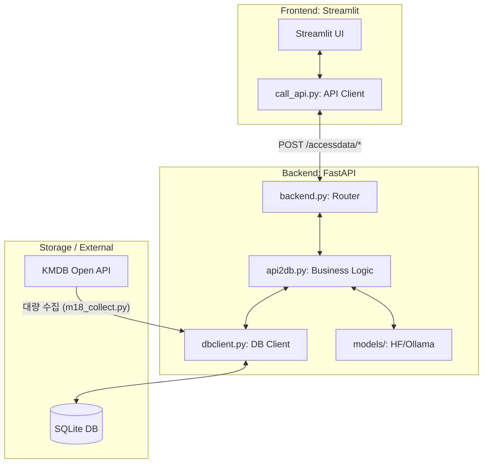
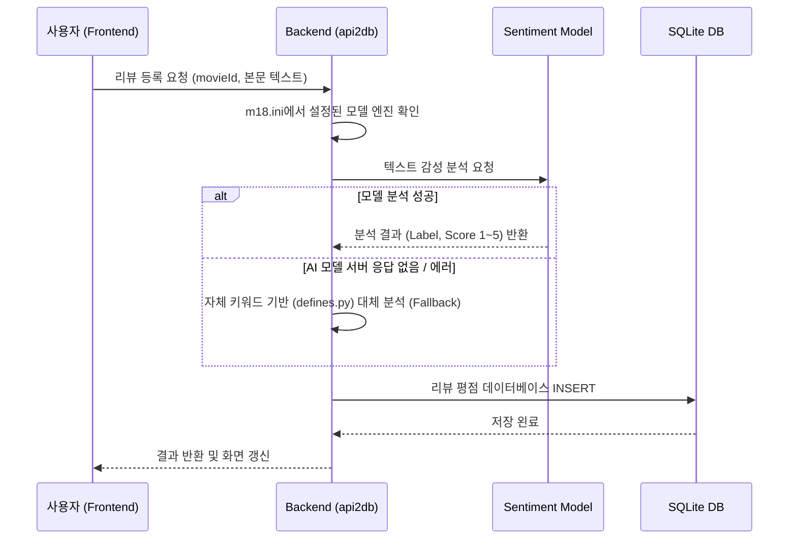
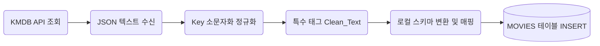

---
# Mission18 기술문서 (TECH.md)

이 문서는 Mission18 프로젝트의 전체 소스 코드 구성, 상세 기술 명세 및 시스템 흐름을 설명합니다. 본 문서를 통해 프로젝트의 모든 구성 요소와 데이터 흐름을 완벽하게 파악할 수 있습니다.

## 1. 프로젝트 개요
- **목적**: 영화 및 리뷰 데이터를 KMDB API를 통해 수집하고, AI 감성 분석 모델을 활용하여 데이터 기반의 영화 정보 시스템을 구축함
- **핵심 기능**: 연도별 영화 자동 수집, 리뷰 등록 및 자동 감성 분석, 상세 검색 및 관리 UI 제공

---

## 2. 전체 시스템 구조 및 파이프라인 시각화

### 2.1 시스템 아키텍처 다이어그램 (System Architecture)
```text

┌─────────────────────────────────────────────────────────┐
│                   Frontend: Streamlit                   │
│          ┌───────────────────────────────────┐          │
│          │         * Streamlit UI            │          │
│          └─────────────────┬─────────────────┘          │
│                            │                            │
│          ┌─────────────────▼─────────────────┐          │
│          │      call_api.py: API Client  │          │
│          └─────────────────┬─────────────────┘          │
└────────────────────────────│────────────────────────────┘
                             │
                  POST /accessdata/*
                             │
┌────────────────────────────▼────────────────────────────┐
│                    Backend: FastAPI                     │
│          ┌───────────────────────────────────┐          │
│          │      [🛣️]  backend.py: Router     │          │
│          └─────────────────┬─────────────────┘          │
│                            │                            │
│          ┌─────────────────▼─────────────────┐          │
│          │   [⚙️] api2db.py: Business Logic   │          │
│          └───────────┬───────────────┬───────┘          │
│                      │               │                  │
│          ┌───────────▼───────┐ ┌─────▼───────────────┐  │
│          │ [🔌] dbclient.py  │ │ [🧠] models/:       │  │
│          │      DB Client    │ │      HF/Ollama      │  │
│          └───────────▲───────┘ └─────────────────────┘  │
└──────────────────────│──────────────────────────────────┘
                       │
┌──────────────────────│──────────────────────────────────┐
│              Storage / External                         │
│   ┌──────────────────┴──────────────┐                   │
│   │     [🔗]  KMDB Open API         │                   │
│   └──────────────────┬──────────────┘                   │
│            대량 수집 (m18_collect.py)                   │
│                      │                                  │
│              ┌───────▼───────┐                          │
│              │ [🗄️] SQLite DB  │                          │
│              └───────────────┘                          │
└─────────────────────────────────────────────────────────┘

```



### 2.2 리뷰 감성 분석 파이프라인 (Sequence Flow)
사용자가 리뷰를 등록할 때 발생하는 자동 감성 분석의 백엔드 흐름입니다.

```text
👤 사용자(FE)        ⚙️ 백엔드(api2db)        🤖 AI 모델            🗄️ 데이터베이스
     │                     │                     │                     │
     │ 1. ✍️ 리뷰 등록 요청  │                     │                     │
     ├────────────────────►│                     │                     │
     │                     │ 2. 📋 모델 설정 확인  │                     │
     │                     ├───────────► (m18.ini 등 설정 로드)          │
     │                     │                     │                     │
     │                     │ 3. 🧠 텍스트 분석 요청│                     │
     │                     ├────────────────────►│                     │
     │                     │                     │                     │
     │                     │ 4-A. ✅ 분석 성공 결과│                     │
     │                     │◄────────────────────┤                     │
     │                     │                     │                     │
     │                     │ 4-B. ⚠️ 분석 실패 시 대체 로직(Fallback) 수행 │
     │                     ├───────────► (키워드 기반 분석/defines.py)   │
     │                     │                     │                     │
     │                     │ 5. 💾 평점/분석결과 DB 저장(INSERT)         │
     │                     ├──────────────────────────────────────────►│
     │                     │                     │                     │
     │                     │ 6. 🆗 DB 저장 확인    │                     │
     │                     │◄──────────────────────────────────────────┤
     │ 7. 🔄 화면 갱신 완료  │                     │                     │
     │◄────────────────────┤                     │                     │
```



---

## 3. 전체 소스 코드 맵 (Full Source Map)

프로젝트의 모든 소스 파일에 대한 역할과 위치를 상세히 정의합니다.

### 📁 1. 공통 모듈 (`common/`) - 전역 설정 및 유틸리티
| 파일명 | 주요 역할 | 상세 기능 |
|---|---|---|
| `defines.py` | 전역 상수 정의 | DB 경로, 감성 수치, 긍/부정 키워드 리스트, 앱 메타데이터 정의 |
| `m18.ini` | 환경 설정 파일 | Backend URL, 사용할 감성 분석 모델 엔진 선택, 모델 경로 설정 |
| `util.py` | API & 데이터 유틸 | 일관된 REST 응답 형식(`ok_response`, `error_response`) 및 타입 변환 유틸 |
| `functions.py` | 보조 함수 | 날짜 포맷팅 등 비즈니스 독립적인 순수 연산 함수 모음 |

### 📁 2. 백엔드 (`backend/`) - 데이터 처리 및 AI 서버
| 파일명/디렉토리 | 주요 역할 | 상세 기능 |
|---|---|---|
| `backend.py` | FastAPI 실행기 | 전체 API 라우팅 및 서버 실행 설정 (포트 8019 유지) |
| `api2db.py` | 비즈니스 로직 제어 | 프론트엔드 요청을 받아 DB CRUD 및 감성 분석 파이프라인 총괄 |
| **`db/`** | 데이터 수집 및 관리 | SQLite 기반 영구 스토리지 제어 및 외부 데이터 수집 |
| - `m18_collect.py` | **데이터 수집 명세** | KMDB API 기반 영화 대량 수집 및 데이터 클렌징(Clean_Text) 로직 |
| - `dbclient.py` | DB 인터페이스 | SQLite 로우 쿼리 실행기 (`SelectSQL`, `ExecuteSQL`) |
| - `m18_sqlite_migration.py` | 마이그레이션 실행 | SQL 파일을 읽어 초기 DB 테이블 구조(MOVIES/REVIEWS) 생성 |
| - `m18_sqlite_migration.sql` | DB 스키마 정의 | 테이블 생성 및 인덱스 설정용 SQL 스크립트 |
| **`models/`** | 감성 분석 엔진 | AI 기반 텍스트 분석 모듈 |
| - `base_model.py` | 모델 추상 클래스 | 분석 모델 간의 인터페이스 표준화 |
| - `huggingface_model.py` | HF 연동 구현 | Transformers 라이브러리를 이용한 로컬 기반 감성 분석 |
| - `ollama_model.py` | Ollama 연동 구현 | Llama3 등 LLM 서버 API와의 통신을 통한 감성 분석 |

### 📁 3. 프론트엔드 (`frontend/`) - 사용자 인터페이스
| 파일명/디렉토리 | 주요 역할 | 상세 기능 |
|---|---|---|
| `frontend.py` | Streamlit 게이트웨이 | 메인 화면 구성 및 탭 기반 페이지 전환(runpy 활용) 제어 |
| `call_api.py` | API 클라이언트 | 백엔드 `/accessdata` 엔드포인트와 통신 및 데이터 정규화 로직 |
| **`pages/`** | 개별 화면 로직 | Streamlit 단독 페이지들 |
| - `movie_list_page.py` | 영화 목록/검색/상세 | 조건별 필터링, 평점 통계 조회 및 영화 삭제 기능 |
| - `movie_create_page.py` | 영화 추가 화면 | 사용자가 직접 새로운 영화 정보를 입력하고 등록하는 UI |
| - `review_list_page.py` | 리뷰 대시보드 | 프로젝트 내 모든 리뷰 목록 및 감성 분석 분포 확인 |
| - `review_create_page.py` | 리뷰 등록 화면 | 리뷰 작성 시 즉시 감성 분석 모델을 호출하여 결과 확인 가능 |

---

## 4. 핵심 시스템 흐름 및 기능 상세

### 4.1 데이터 수집 및 정제 시스템 파이프라인 (`m18_collect.py`)

```text
[🌐 KMDB API 조회] ──► [📥 JSON 수신] ──► [🔠 정규화/소문자 변환] 
                                                    │
                                                    ▼
[💾 ︎MOVIES 테이블 INSERT] ◄── [🧩 로컬 스키마 매핑] ◄── [🧹 태그/HTML 자체 정제]
```



- **수집 대상**: KMDB API를 통해 **1900년부터 2026년까지**의 대한민국 **국내 극영화** 전체 데이터를 타겟으로 수집
- **수집 방식**: `Get_Movie_Data` -> `normalize_keys` -> `Clean_Text` -> `SQLiteDB.saveMovie`
- **페이지네이션**: `listCount` 500개 단위로 루프를 돌며 대량의 영화 데이터를 안정적으로 전송
- **기록 유의사항**: 이 파일은 프로젝트 초기 DB 구축을 위한 핵심 명세이며, 필드 매핑 로직이 포함되어 있습니다.

### 4.2 감성 분석 로직 (`api2db.py`)
- **모델 결정**: `m18.ini`의 `[sentiment] usemodel` 설정값에 따라 분석 엔진 동적 선택
- **하이브리드 파이프라인 처리**: 지정된 모델로 실패하더라도 `defines.py`의 키워드 리스트를 이용한 **Keyword 기반 하이브리드 분석**으로 100% 서비스 동작을 보장.

### 4.3 프론트-백 연동 규격
- 모든 명령형 요청(GET 포함)은 백엔드의 보안 및 일관성을 위해 **`/accessdata/{action}`** 형태의 **POST** 방식으로 통신하며, 요청 바디에 JSON 파라미터를 담아 전달합니다.

---

## 5. 데이터베이스 구조 (Summary)

### MOVIES (영화 데이터)
| 필드 | 설명 |
|---|---|
| `movieId` | 내부 PK (Integer) |
| `docid` | 외부 문서 ID |
| `title` | 영화 제목 (정제됨) |
| `repRlsDate` | 대표 개봉일 |
| `posterUrl` | 포스터 이미지 링크 |

### REVIEWS (리뷰 데이터)
| 필드 | 설명 |
|---|---|
| `reviewId` | 리뷰 PK |
| `movieId` | 대상 영화 ID (FK) |
| `sentimentLabel` | 긍정/중립/부정 판정 |
| `sentimentScore` | 수치형 분석 결과 (1.0~5.0) |

---

## 6. 외부 API 연동 기법 및 명세 (KMDB)

`m18_collect.py`에서 한국영화데이터베이스(KMDB) 외부 API를 호출할 때 사용하는 파라미터와 수집 결과 매핑 형태입니다.

### 6.1 API 요청 파라미터 (GET / OpenAPI)
| 파라미터명 | 값 예시 | 설명 |
|---|---|---|
| `collection` | `kmdb_new2` | 사용할 KMDB 컬렉션 (고정) |
| `nation` | `대한민국` | 제작 국가 필터링 (고정) |
| `ServiceKey` | (발급받은 키) | API 인증 키 |
| `listCount` | `500` | 한 번에 가져올 데이터 개수 (페이지네이션을 위해 초기값 500 사용) |
| `startCount` | `0` | 조회 시작 위치 / 오프셋 기능 |
| `releaseDts` | `YYYY0101` | 개봉일 검색 시작일 (특정 연도 기반 전체 영화 조회를 위해 1월 1일 지정) |
| `releaseDte` | `YYYY1231` | 개봉일 검색 종료일 (특정 연도 기반 전체 영화 조회를 위해 12월 31일 지정) |

### 6.2 주요 수집 결과 데이터 및 필드 변환 매핑
API에서 반환되는 JSON 데이터 필드(`movie`)의 주요 항목이 로컬 스토리지에 어떻게 매핑되고 정제되는지 보여줍니다.

| KMDB 원본 JSON 필드 (소문자화 이후) | 저장/응답 필드 (MOVIES) | 정제 및 변환 방식 |
|---|---|---|
| `docid` | `docid` | 고유 식별자 그대로 사용 (값이 누락된 경우 수집에서 제외됨) |
| `movieid` / `movieseq` | `kmdbMovieId` / `movieSeq`| 자체 DB의 자동증가 PK인 `movieId(int)` 필드명과 충돌을 회피하기 위해 변경 |
| `title` | `title` | API가 전달하는 특수 태그(`!HS`, `!HE` 등)를 자체 `Clean_Text` 함수로 제거·정제 |
| `directors.director.directornm` | `directorNm` | 배열(리스트)일 경우 텍스트를 파싱하여 `, ` 형태로 결합 (Join 처리) |
| `actors.actor.actornm` | `actorNm` | 다수 배우 목록 중 주요 최대 5명까지만 추출하고 결합 (limit=5) |
| `genre` | `genre` | 그대로 저장 |
| `posters` | `posterUrl` | 여러 포스터 URL이 `\|` 기호로 묶여서 오는 경우, `split('\|')[0]`로 첫 이미지 URL만 채택 |
| `rating.reprlsdate` / `releasedate` | `repRlsDate` / `releaseDate`| 다양한 속성 중 대표 개봉일을 우선 판단하여 빈 값일 경우 상호 보완 적용 |
| `plots.plot.plottext` | `plot` | 다건의 영화 줄거리 정보 블록 중 가장 첫 번째 줄거리 원문(텍스트부분)을 추출 |

---

## 7. 확장 가이드
- **새로운 수집원 추가**: `backend/db/` 내에 새로운 수집 모듈을 작성하고 `m18_collect.py`와 같은 방식으로 `SQLiteDB` 클래스에 연결하십시오.
- **분석 모델 교체**: `models/` 폴더에 추상 클래스를 상속받는 새 모델 파일을 만들고 `api2db.py`의 팩토리 로직에 등록하십시오.