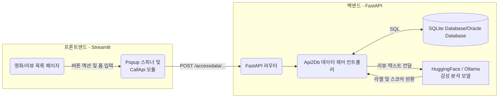
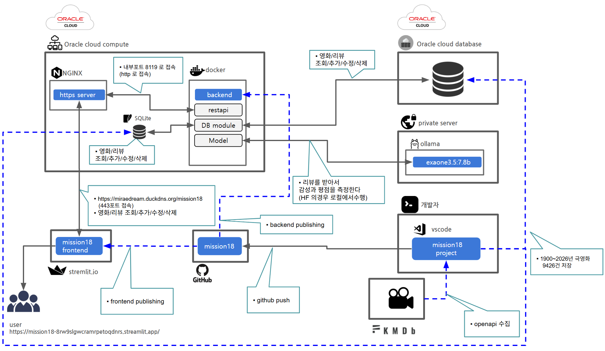
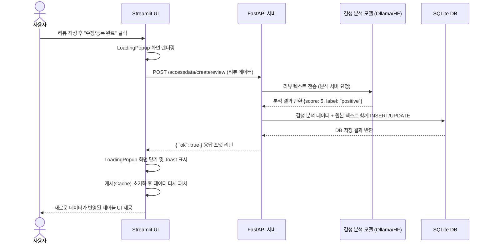

# Mission18 프로젝트 보고서

## 1. 프로젝트 개요

프로젝트명: **Mission18 영화 정보 및 리뷰 감성 분석 서비스**

본 프로젝트는 사용자가 영화 정보 및 리뷰를 리스트로 열람하고, 새로운 영화와 리뷰를 관리할 수 있는 서비스이다. 
가장 큰 특징은 사용자가 남긴 리뷰 내용을 바탕으로 **AI 모델이 자동으로 내용의 긍정/부정 감성을 분석하고 1~5점 사이의 평점을 부여**하여 시각화한다는 점이다. 프론트엔드는 Streamlit으로, 데이터 및 모델 서빙을 담당하는 백엔드는 FastAPI 구조로 완전히 분리(Decoupling)하여 개발되었다.

### 이 프로젝트의 주요 목적
- AI 기반 감성 분석(Sentiment Analysis)을 실제 사용자 서비스와 연동
- Streamlit과 FastAPI 간의 완전 분리형 Full-Stack 애플리케이션 구조 체험
- 대량의 영화/리뷰 데이터를 조회/필터링/생성/수정/삭제하는 데이터베이스 워크플로우 경험

---

## 2. 데이터 수집 및 구축 (Data Collection)

본 프로젝트의 데이터베이스는 KMDB(한국영화데이터베이스) 오픈 API를 통해 구축되었다.

- **수집 도구**: `backend/db/m18_collect.py`
- **수집 범위**: **1900년부터 2026년까지** 제작/개봉된 **대한민국 한국 극영화** 데이터 전체
- **수집 공정**:
  1. KMDB API에 연도별, 국가(대한민국) 필터로 요청
  2. 500개 단위 페이지네이션 처리를 통해 데이터 유실 방지
  3. API 응답 텍스트(제목, 줄거리 등) 내 불필요한 HTML 태그 및 특수 기호(`!HS`, `!HE`) 정제 처리
  4. 로컬 스키마에 맞춰 필드 매핑 후 SQLite DB/oracle 에 최종 적재

---

## 3. 주요 기능

- **로그인 및 회원가입**
  - 별도의 로그인/회원가입 페이지를 제공하며, 사용자 인증 및 세션 관리를 지원한다.
  - 로그인 UI는 Streamlit 기반의 커스텀 스타일로 제공되며, 아이디/비밀번호 입력, 오류 메시지, 성공 메시지, 회원가입 버튼 등 UX를 강화하였다.
  - 회원 정보는 백엔드의 movie_user 테이블에 안전하게 저장되며, 인증 성공 시 세션에 사용자 정보가 저장되어 이후 모든 기능에서 활용된다.
  - 로그인/회원가입 로직은 frontend/login.py의 show_login() 함수로 통합 관리되어, 유지보수성과 일관성이 뛰어나다.

- **영화 관리 (CRUD)**
  - 영화 목록 조회 (페이지네이션, 다중 필터 검색 지원)
  - 새로운 영화 등록 및 데이터 수정, 삭제 기능 지원
- **리뷰 및 감성 분석**
  - 특정 영화의 종속된 사용자 리뷰 작성 지원
  - 전체 리뷰를 모아볼 수 있는 통합 뷰(View) 및 필터 옵션 지원
  - **AI 감성 분석**: 사용자가 리뷰 본문을 입력하면 Ollama, HuggingFace 등 연동된 모델 모듈이 문장 분석 후 `positive`, `neutral`, `negative` 라벨 및 1~5 평점을 자동 도출
- **캐시 및 최적화**
  - Streamlit의 `session_state`를 통한 프론트엔드 캐싱으로 획기적인 서버 부하 경감 완료 및 실사용감 향상
  - 로딩 시 사용자 친화적인 Popup overlay (스피너 애니메이션) 구현

---

## 3. 시스템 구성

### 3-1. 실제 서비스/운영 환경 및 인프라 구조

- **Frontend**: GitHub 저장소와 연동되어 streamlit.io(Cloud)에서 서비스된다. (CI/CD 또는 수동 배포)
- **Backend**: Oracle Cloud의 Compute 인스턴스에서 FastAPI 서버가 구동된다.
- **Ollama**: 프라이빗 개인 PC에서 Ollama LLM 서비스가 실행되며, 백엔드에서 네트워크를 통해 API 호출로 연동한다.
- **Oracle Database**: Oracle Cloud Database를 사용하여 일부 데이터(또는 확장 시)를 저장/관리한다.
- **HuggingFace, SQLite**: 백엔드 서버(Oracle Cloud Compute) 내에서 로컬로 실행 및 관리된다. (HuggingFace 모델은 서버 내에서 직접 inference, SQLite는 파일 기반 DB)

프론트엔드와 백엔드는 완전히 분리되어 있으며, 상호간 통신은 오직 HTTP API로만 이뤄진다.

### 3-2. 아키텍처 다이어그램 (텍스트/mermaid)

### 3-3. 전체 인프라/서비스 아키텍처(이미지)

---

## 4. 데이터 플로우 파이프라인

영화 리뷰 등록 시 데이터 파이프라인은 다음과 같이 구성된다. 

---

## 5. 핵심 구현 내용 및 차별점

### 5-1. AI 감성 분석 모델의 유연한 연동 구조
- **Model Interface**: `BaseModel` 인터페이스 아래에 HuggingFace와 Ollama 모듈 각각을 상속 기반으로 연동해, `common/m18.ini` 파일 설정만으로 사용하는 AI 모델을 동적으로 스왑 가능하게 구현되어 있다.

### 5-2. `__enter__`, `__exit__` 컨텍스트로 구현한 Loading Popup 창
- 단순히 하단에 작게 뜨는 Streamlit 기본 스피너의 한계를 극복하고 사용성을 개선하기 위해, 백그라운드 CSS 삽입과 Context Manager 구문을 결합하여 만든 커스텀 `LoadingPopup` 화면을 도입하였다. 리뷰를 분석하거나 조회하는 동안 완벽한 모달 형식으로 조작을 방지하며 기다림을 부각한다.

### 5-3. 세션 메모리(Cache)를 활용한 렌더 사이클 최적화 방어
- Streamlit 고유의 **모든 컴포넌트 동작 시 매번 전체 코드를 리렌더링하는 현상**으로 인한 무의미한 DB Fetch를 방어하였다. `st.session_state`에 마지막 조회 필터 조건과 페이징 조건을 저장한 후 이가 변하지 않았다면 캐시에서 즉시 불러오며, CUD(Create, Update, Delete) 성공 시에만 즉각적으로 해당 키를 무력화(Invalidate)하여 아주 부드럽고 쾌적하게 동작한다. 

---

## 6. 사용 기술 스택 (기술 명세)

| 분류 | 기술 명칭 | 역할 |
|---|---|---|
| **Frontend** | Streamlit, Python | 반응형 웹 UI 구성, 백엔드 API와의 통신 (`requests`) |
| **Backend** | FastAPI, Uvicorn | API 제공, 데이터 인코딩/디코딩 라우터 처리 |
| **Database** | SQLite, Oracle | 데이터베이스 드라이버, 원시 SQL문 실행 및 영속성 보장 |
| **AI Models** | Ollama, Transformer(HuggingFace) | 자연어 처리 및 문장 긍정/부정 감성 분류 |

---

## 7. 브리핑 및 시연 시나리오 가이드

발표 및 시연은 다음 순서로 진행하는 것이 효과적이다:
1. **프로젝트 목적 및 구성도 소개** (보고서의 구조 및 다이어그램 활용)
2. **영화 목록 표시 및 필터 시연** (다양한 검색 기능 및 빠른 조회 캐싱 설명)
3. **영화 추가/삭제 시연** (데이터베이스 갱신 및 팝업 렌더링 강조)
4. **리뷰 등록 및 감성 분석 동작 확인**
  - 악성 또는 긍정적 평을 작성한 뒤 `리뷰등록`을 클릭한다.
  - 로딩 스피너가 구동되는 동안 백엔드 AI 모델이 동작함을 설명한다.
  - 반환된 리뷰에 `positive` 및 평점이 자동 계산되어 도출되는지 확인한다.
5. **리뷰 전체 목록 창에서 다중 필터 기능 증명** (감성 점수 1점, 혹은 부정적 리뷰만 필터링하여 확인)

---

## 8. 결론

본 Mission18 프로젝트는 Streamlit을 프론트엔드, FastAPI를 백엔드로 사용하여 유기적인 데이터 통신과 화면 제어 기술을 구현하였다. 그리고 분산 환경을 제공하여 실무와 동일하게 구성하였다.
특히 리뷰 문자열 분석 AI를 서비스 로직에 통합하고, 파이프라인의 캐시 최적화 및 사용자 친화적 애니메이션(LoadingPopup) 구현을 통해 기획, 백엔드 로직 설계, 인공지능 접목, UI 개발의 전 과정을 경험하였다.

## 향후 과제
1. 다중 사용자 지원 시 JWT 등 보안을 강화한 인증 체계가 필요하며, 각 세션별로 데이터를 완전 분리하여 관리해야 한다. 또한, 비동기 기술 적용으로 사용자의 대기 시간을 최소화해야 한다.
2. Open API를 활용한 영화 정보 수집 및 DB 연동을 통해 영화 목록을 자동화해야 한다.
 

 ## 이미지 캡처
 1. FastAPI  Docs 전체 캡처.(상세 명세는 TECH.md에 있음)

 2. 서비스 동착 캡쳐 이미지
    1. 로그인 화면
    2. 영화 목록 화면
    3. 영화 추가 화면
    4. 영화 수정 화면
    5. 영화 삭제 화면
    6. 리뷰 목록 화면
    7. 리뷰 추가 화면
    8. 리뷰 수정 화면
    9. 리뷰 삭제 화면
    10. 모든 리뷰 통합 검색 및 필터링 화면
    11. 통합 리뷰 건수 집계 (페이징용) 화면
    
