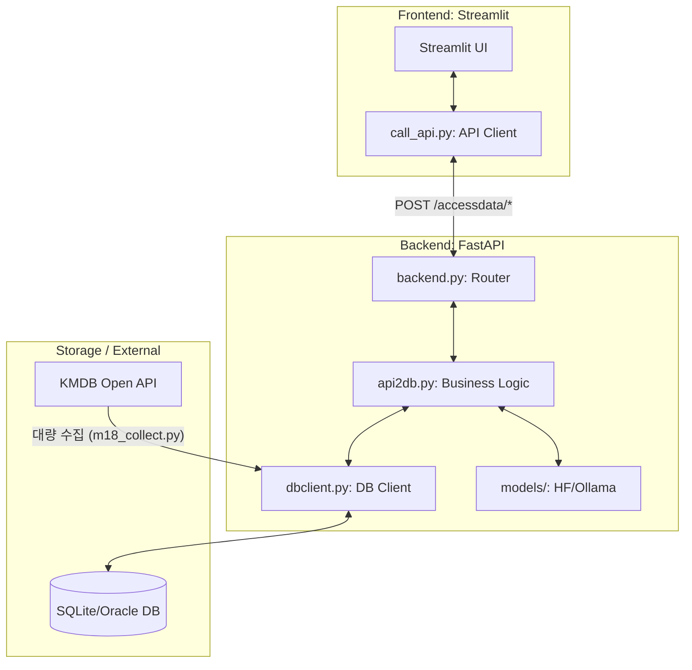
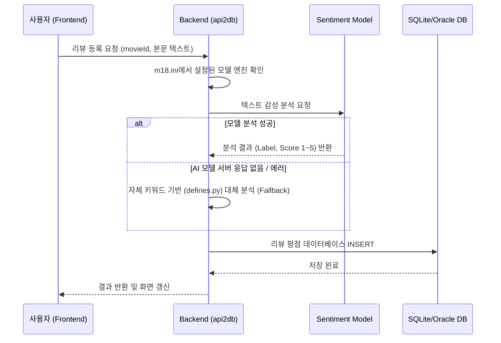
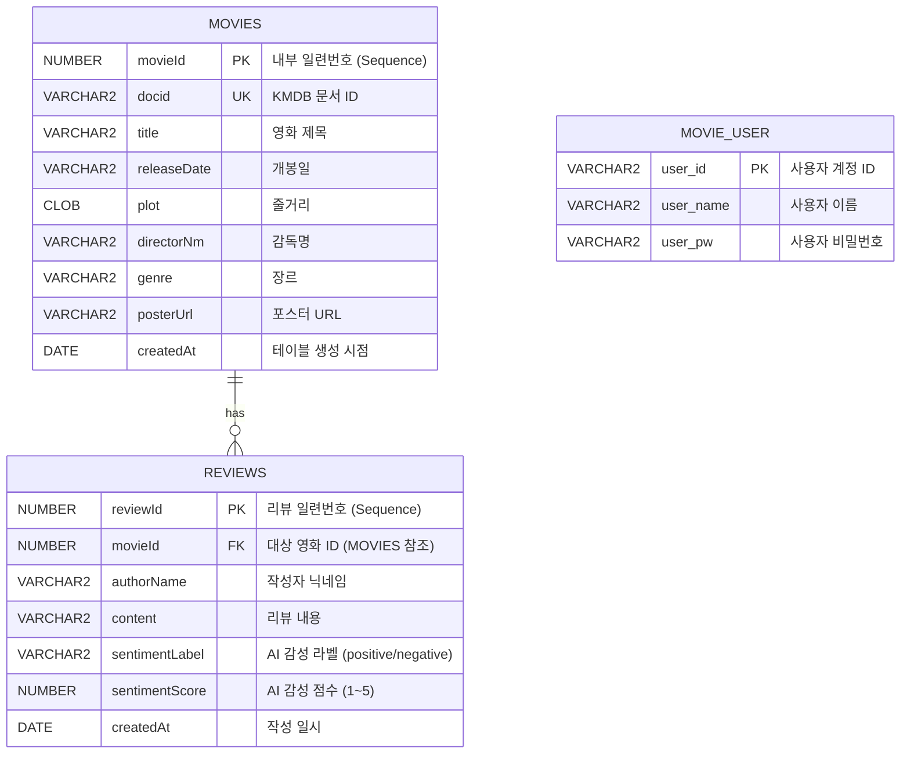
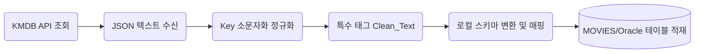

# Mission18 프로젝트 통합 보고서 (Integrated Document)

이 문서는 Mission18 프로젝트의 개요, 시스템 아키텍처, 상세 기능, 데이터베이스 구조 및 API 명세를 모두 포함하는 통합 최종 보고서입니다.

---

## 목차
1. [프로젝트 개요](#1-프로젝트-개요)
2. [시스템 구성 및 아키텍처](#2-시스템-구성-및-아키텍처)
3. [주요 기능 및 데이터 플로우](#3-주요-기능-및-데이터-플로우)
4. [상세 소스 코드 맵 (Full Source Map)](#4-상세-소스-코드-맵-full-source-map)
5. [데이터베이스 설계](#5-데이터베이스-설계)
6. [데이터 수집 및 정제 시스템 (KMDB 연동)](#6-데이터-수집-및-정제-시스템-kmdb-연동)
7. [핵심 구현 내용 및 차별점](#7-핵심-구현-내용-및-차별점)
8. [백엔드 API 명세](#8-백엔드-api-명세)
9. [사용 기술 스택 및 확장 가이드](#9-사용-기술-스택-및-확장-가이드)
10. [결론 및 향후 과제](#10-결론-및-향후-과제)
11. [부록: 시연 시나리오 및 이미지 캡처 가이드](#11-부록-시연-시나리오-및-이미지-캡처-가이드)

---

## 1. 프로젝트 개요

- **프로젝트명**: **Mission18 영화 정보 및 리뷰 감성 분석 서비스**
- **목적**: 사용자가 영화 정보 및 리뷰를 리스트로 열람하고, 새로운 영화와 리뷰를 관리하며, AI 모델을 통해 리뷰의 감성을 자동 분석하여 시각화하는 Full-Stack 서비스를 구축함
- **주요 목적**:
  - AI 기반 감성 분석(Sentiment Analysis)을 실제 사용자 서비스와 연동
  - Streamlit(FE)과 FastAPI(BE) 간의 완전 분리형(Decoupling) 애플리케이션 구조 체험
  - 대량의 영화 데이터를 오픈 API(KMDB)로 수집하고 관리하는 전체 워크플로우 경험

---

## 2. 시스템 구성 및 아키텍처

### 2.1 실제 서비스 운영 환경 및 인프라 구조
- **Frontend**: GitHub 저장소와 연동되어 `streamlit.io(Cloud)`에서 서비스된다.
- **Backend**: `Oracle Cloud`의 Compute 인스턴스에서 FastAPI 서버가 구동된다.
- **AI Models (Ollama)**: 프라이빗 개인 PC에서 Ollama LLM 서비스가 실행되며, 백엔드에서 네트워크 호출로 연동한다.
- **Database**: `Oracle Cloud Database` 및 백엔드 로컬의 `SQLite`를 병행하여 사용한다.
- **HuggingFace**: 백엔드 서버 내에서 로컬 인퍼런스를 통해 리뷰 분석을 수행한다.

### 2.2 시스템 아키텍처 다이어그램


### 2.3 인프라 아키텍처 (이미지)


---

## 3. 주요 기능 및 데이터 플로우

### 3.1 주요 기능 상세
- **사용자 인증**: 별도의 로그인/회원가입 페이지와 세션 관리를 지원하며, `movie_user` 테이블에 정보를 안전하게 저장한다.
- **영화 관리 (CRUD)**: 전체 영화 목록 조회(페이지네이션 적용), 상세 검색, 신규 등록 및 수정/삭제를 지원한다.
- **리뷰 및 AI 감성 분석**:
  - 특정 영화에 대한 사용자 리뷰를 작성하면 AI 모델(Ollama/HF)이 문장을 분석한다.
  - 분석 결과(`positive`, `neutral`, `negative`)와 1~5점 평점을 시스템이 자동 도출하여 저장한다.
- **UX 및 성능 최적화**:
  - CSS와 Context Manager를 활용한 **Loading Popup(모달 스피너)** 구현.
  - `session_state`를 활용한 프론트엔드 캐싱으로 불필요한 DB Fetch 방어.

### 3.2 리뷰 감성 분석 시퀀스 다이어그램


---

## 4. 상세 소스 코드 맵 (Full Source Map)

### 📁 공통 모듈 (`common/`)
- `defines.py`: 전역 상수, 감성 수치, 긍/부정 키워드 리스트 정의.
- `m18.ini`: 백엔드 URL 및 사용할 AI 모델 엔진 설정.
- `util.py`: REST 응답 공통 포맷 관리.

### 📁 백엔드 (`backend/`)
- `backend.py`: FastAPI 라우팅 및 서버 실행.
- `api2db.py`: 비즈니스 로직 및 감성 분석 파이프라인 총괄.
- `db/`: DB 제어 및 KMDB 데이터 수집 모듈 (`m18_collect.py`, `dbclient.py`).
- `models/`: HuggingFace 및 Ollama 연동 모듈.

### 📁 프론트엔드 (`frontend/`)
- `frontend.py`: Streamlit 메인 게이트웨이 및 페이지 레이아웃.
- `call_api.py`: 백엔드 통신 및 데이터 정규화.
- `login.py`: 로그인 UI 및 인증 로직 통합 관리.
- `pages/`: 개별 화면 구성 (영화 목록, 등록, 리뷰 관리 등).

---

## 5. 데이터베이스 설계

### 5.1 데이터베이스 ERD (Oracle 기준)


---

## 6. 데이터 수집 및 정제 시스템 (KMDB 연동)

### 6.1 데이터 수집 프로세스
- **수집 범위**: 1900년~2026년 대한민국 제작/개봉 극영화 전체.
- **기술 스택**: `m18_collect.py` 기반의 KMDB API 500개 단위 페이지네이션 수집.
- **정제 내역**: HTML 특수 태그(`!HS`, `!HE`) 및 불필요한 기호 자동 정규화 처리.

### 6.2 수집 파이프라인 시각화


---

## 7. 핵심 구현 내용 및 차별점

- **AI 모델 스왑 구조**: `BaseModel` 추상화와 `m18.ini` 설정을 통해 HF 모델과 Ollama 모델을 코드 수정 없이 자유롭게 전환 가능하다.
- **커스텀 Loading Popup**: Streamlit 기본 스피너의 한계를 극복하기 위해 Context Manager와 CSS를 결합한 모달 형식의 로딩 화면을 도입하였다.
- **캐시 기반 렌더링 방어**: 모든 리렌더링마다 DB 조회를 방지하기 위해 `session_state` 기반 필터 캐싱을 구현하여 실사용감을 획기적으로 향상시켰다.

---

## 8. 백엔드 API 명세

### 8.1 기본 접속 정보
| 환경 | 주소 | 설명 |
|---|---|---|
| Base URL (로컬) | `http://127.0.0.1:8019` | FastAPI 백엔드 서버 기본 URL |
| Swagger UI | `http://127.0.0.1:8019/docs` | 내장 자동화 API 테스트 사이트 |

### 8.2 공통 응답 포맷 (JSON)
```json
{
  "code": "OK",              // 정상이면 "OK", 에러 시 "Error"
  "ok": true,                // 내부 요청 성공 여부 (true/false)
  "message": "",             // 에러 발생 시의 원문 메시지
  "datalist": [...],         // 데이터 배열
  "datacount": 10            // 데이터 개수 또는 총 집계 카운트
}
```

### 8.3 REST API 엔드포인트 상세

#### 1. 영화 목록 조회
- **URL**: `POST /accessdata/getmovies`
- **Request Body**: `{"COUNT": "10", "START": "0", "TITLE": "제목", "DIRECTOR": "감독", "RELEASE_START": "YYYY-MM-DD", ...}`
- **Response**: `datalist` 내에 영화 메타 데이터 배열 반환.

#### 2. 영화 건수 조회 (페이징용)
- **URL**: `POST /accessdata/getmoviescount`
- **Response**: `datacount`에 필터링된 전체 영화 개수 반환.

#### 3. 영화 등록
- **URL**: `POST /accessdata/createmovie`
- **Request Body**: `{"title": "제목", "releaseDate": "YYYY-MM-DD", "directorNm": "감독", "genre": "장르", ...}`

#### 4. 영화 정보 수정
- **URL**: `POST /accessdata/updatemovie`
- **Request Body**: `{"movieId": 1, "title": "수정 제목", ...}`

#### 5. 영화 삭제 (하위 리뷰 포함)
- **URL**: `POST /accessdata/deletemovie`
- **Request Body**: `{"movieId": 1}`

#### 6. 영화별 리뷰 리스트 조회
- **URL**: `POST /accessdata/getreviews`
- **Request Body**: `{"movieId": 1}`

#### 7. 리뷰 등록 (AI 실시간 감성 분석)
- **URL**: `POST /accessdata/createreview`
- **Request Body**: `{"movieId": 1, "authorName": "작성자", "content": "리뷰내용"}`
- **특이사항**: 서버에서 감성 분석 모델을 호출하여 `sentimentLabel`, `sentimentScore`를 자동 주입.

#### 8. 리뷰 수정 (AI 재분석 수행)
- **URL**: `POST /accessdata/updatereview`
- **Request Body**: `{"reviewId": 12, "content": "수정내용"}`

#### 9. 리뷰 삭제
- **URL**: `POST /accessdata/deletereview`
- **Request Body**: `{"reviewId": 12}`

#### 10. 전체 리뷰 통합 검색 및 필터링
- **URL**: `POST /accessdata/getallreviews`
- **Request Body**: `{"SENTIMENT_LABEL": "negative", "SENTIMENT_SCORE": "1", "CONTENT": "키워드", ...}`

#### 11. 통합 리뷰 건수 집계 (페이징용)
- **URL**: `POST /accessdata/getallreviewscount`
- **Response**: `datacount`에 검색 조건에 맞는 전체 리뷰 개수 반환.

---

## 9. 사용 기술 스택 및 확장 가이드

### 9.1 기술 스택 명세
| 분류 | 기술 명칭 | 역할 |
|---|---|---|
| **Frontend** | Streamlit, Python | 반응형 웹 UI, API 클라이언트 (`requests`) |
| **Backend** | FastAPI, Uvicorn | API 제공, 비즈니스 로직 제어 |
| **Database** | Oracle, SQLite | 데이터 영속성 보장, SQL 실행 |
| **AI Models** | Ollama, HuggingFace | 자연어 처리 및 감성 분류 |

### 9.2 확장 가이드
- **수집원 확대**: `backend/db/` 내에 신규 API 연동 모듈을 추가하여 데이터 소스를 다변화할 수 있다.
- **모델 업그레이드**: `BaseModel`을 상속받은 새 클래스를 추가하여 최신 LLM(GPT-4, Claude 등)으로 손쉽게 교체할 수 있다.

---

## 10. 결론 및 향후 과제

본 Mission18 프로젝트는 Streamlit과 FastAPI를 분리 설계하여 유기적인 데이터 통신 환경을 구축하였으며, AI 모델을 실 서비스에 통합하는 전체 파이프라인을 성공적으로 구현하였다.

### 향후 과제
- **인증 강화**: JWT 기반의 고도화된 보안 토큰 체인 도입 및 세션 데이터 완전 격리.
- **성능 개선**: FastAPI 비동기(async/await) 기능의 전격 도입을 통한 사용자 대기 시간 최소화.
- **데이터 자동화**: KMDB 연동 수집 공정을 스케줄러와 결합하여 정기적인 자동 갱신 체계 구축.

---

## 11. 부록: 시연 시나리오 및 이미지 캡처 가이드

### 11.1 시연 시나리오
1. 프로젝트 목적 및 아키텍처 다이어그램 소개.
2. 영화 목록 검색 및 캐시 동작 시연.
3. 영화 등록/수정/삭제 등 관리 기능 확인.
4. 리뷰 작성 시 AI 모델 동작 및 감성 분석 결과 실시간 도출 시연.
5. 모든 리뷰 통합 검색 창에서의 감성 라벨별 필터링 기능 증명.

### 11.2 이미지 캡처 대상
- FastAPI Swagger Docs 전체 화면
- 서비스 동작 캡처 (로그인, 영화 목록, 영화 추가/수정/삭제, 리뷰 목록/추가/수정/삭제, 통합 필터링 화면 등 총 11개 항목)
